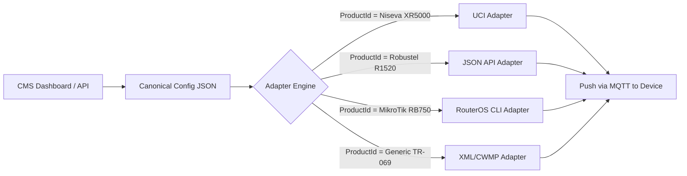
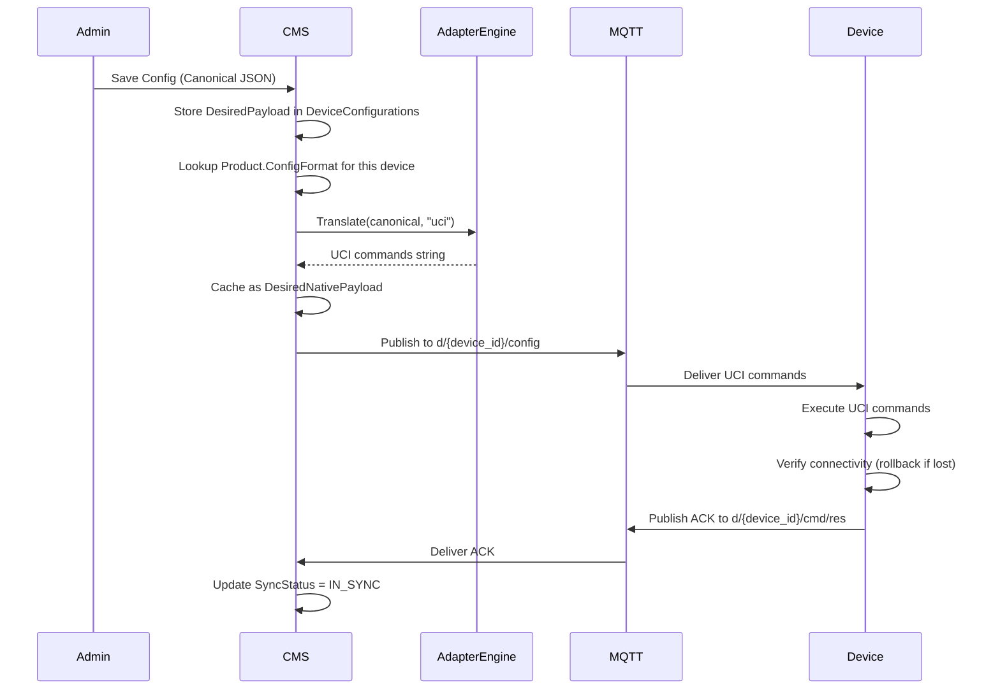
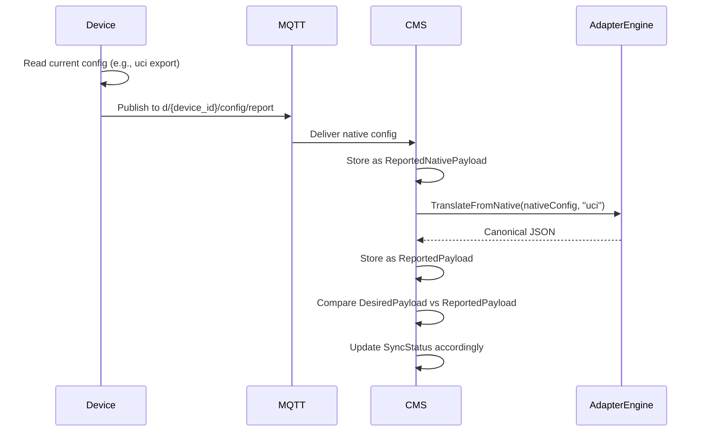

# Configuration Abstraction Layer — Multi-Vendor Config Architecture

The CMS must support devices from multiple vendors, each with a different native configuration system. This document defines how the platform handles this cleanly.

---

## The Problem

| Vendor | Config System | Format | Example |
|---|---|---|---|
| **Niseva (OpenWrt)** | UCI | Key-Value (flat files) | `uci set network.lan.ipaddr=10.0.0.1` |
| **Robustel** | RobustOS API | JSON | `{ "cellular": { "apn": "internet" } }` |
| **MikroTik** | RouterOS CLI | Proprietary CLI | `/ip address set address=10.0.0.1/24` |
| **Generic Linux** | Netplan / systemd | YAML | `network: ethernets: eth0: addresses: [10.0.0.1/24]` |
| **TR-069 Devices** | CWMP | XML (SOAP) | `<ParameterValueStruct>...</ParameterValueStruct>` |

If the CMS stores configurations in vendor-specific formats, it becomes impossible to:
- Build a single UI that manages all devices.
- Create cross-vendor templates (e.g., "Set the LAN IP to X" for any device).
- Compare configurations across different hardware types.

---

## The Solution: Canonical Config Model + Vendor Adapters

The CMS uses a **two-layer architecture**:

### Layer 1: Canonical Config (Stored in CMS Database)
A vendor-neutral, structured JSON schema that the CMS UI and API work with. This is a "logical" representation of what the device should look like.

```json
{
    "schema_version": "1.0",
    "network": {
        "lan": {
            "interface": "br-lan",
            "protocol": "static",
            "ipaddr": "192.168.1.1",
            "netmask": "255.255.255.0",
            "dhcp_enabled": true,
            "dhcp_start": 100,
            "dhcp_limit": 150
        },
        "wan": {
            "interface": "eth0",
            "protocol": "dhcp"
        }
    },
    "wireless": {
        "radio0": {
            "enabled": true,
            "ssid": "BranchOffice-WiFi",
            "encryption": "psk2",
            "key": "securepassword123",
            "channel": "auto",
            "band": "2.4GHz"
        }
    },
    "cellular": {
        "modem0": {
            "enabled": true,
            "apn": "internet",
            "pin": "",
            "auth_type": "none"
        }
    },
    "firewall": {
        "zones": [
            { "name": "lan", "input": "ACCEPT", "output": "ACCEPT", "forward": "ACCEPT" },
            { "name": "wan", "input": "REJECT", "output": "ACCEPT", "forward": "REJECT" }
        ]
    },
    "system": {
        "hostname": "branch-router-01",
        "timezone": "Asia/Kolkata",
        "ntp_enabled": true
    }
}
```

### Layer 2: Vendor Adapters (On the Device Agent or CMS-Side)
A translation engine that converts the Canonical Config into the vendor's native format.

**Where does the translation happen?**

| Strategy | Pros | Cons | Best For |
|---|---|---|---|
| **Device-Side Translation** | CMS sends one universal JSON. Each agent translates locally. | Each agent needs its own adapter. | When you control the firmware/agent on every device (your case). |
| **CMS-Side Translation** | Device receives its native format directly. Agent is simple. | CMS needs adapter plugins per vendor. | When you can't modify the device agent. |
| **Hybrid** | CMS pre-translates for known vendors. Agent handles edge cases. | More complex. | Large multi-vendor fleets. |

### Recommended: **CMS-Side Translation** (Server-Side Adapters)

Since you want **zero firmware customization**, the CMS should pre-translate the canonical JSON into the device's native format before pushing it. The device agent simply receives instructions in its own language.

---

## Architecture



---

## Adapter Interface (C# / .NET)

Each vendor adapter implements a common interface:

```csharp
public interface IConfigAdapter
{
    /// <summary>
    /// Unique identifier matching Products.ConfigFormat in the DB.
    /// </summary>
    string FormatId { get; }  // e.g., "uci", "routeros_cli", "json_api", "xml_cwmp"

    /// <summary>
    /// Converts the CMS canonical config JSON into the vendor-native format.
    /// </summary>
    string TranslateToNative(JsonDocument canonicalConfig);

    /// <summary>
    /// Converts a device-reported native config back into canonical JSON.
    /// </summary>
    JsonDocument TranslateFromNative(string nativeConfig);

    /// <summary>
    /// Generates a diff/changeset between the desired and reported configs
    /// in the vendor's native command format.
    /// </summary>
    string GenerateChangeCommands(JsonDocument desiredCanonical, string reportedNative);
}
```

### Example: UCI Adapter Output
Input (Canonical JSON):
```json
{ "network": { "lan": { "ipaddr": "10.0.0.1", "netmask": "255.255.255.0" } } }
```

Output (UCI Commands):
```
uci set network.lan.ipaddr='10.0.0.1'
uci set network.lan.netmask='255.255.255.0'
uci commit network
/etc/init.d/network restart
```

### Example: XML Adapter Output
Input (Same Canonical JSON):
```json
{ "network": { "lan": { "ipaddr": "10.0.0.1", "netmask": "255.255.255.0" } } }
```

Output (XML):
```xml
<configuration>
  <network>
    <interface name="lan">
      <ip-address>10.0.0.1</ip-address>
      <netmask>255.255.255.0</netmask>
    </interface>
  </network>
</configuration>
```

---

## Database Schema Changes

### Updated: `Products` Table
Add a field to specify which config adapter to use.

*   `ConfigFormat` (VARCHAR) — e.g., `uci`, `json_api`, `routeros_cli`, `xml_cwmp`, `yaml_netplan`
*   `ConfigSchemaVersion` (VARCHAR) — The version of the canonical schema this product supports. Allows for gradual schema evolution.

### Updated: `ConfigurationTemplates` Table
The `Payload` is always stored in **Canonical JSON** format, regardless of the target vendor.

*   `Payload` (JSONB) — Always Canonical JSON. Never vendor-specific.

### Updated: `DeviceConfigurations` Table
*   `DesiredPayload` (JSONB) — **Canonical JSON** (what the CMS wants).
*   `DesiredNativePayload` (TEXT, Nullable) — The translated vendor-specific output (cached). Regenerated whenever `DesiredPayload` or the adapter changes.
*   `ReportedNativePayload` (TEXT, Nullable) — What the device reports in its native format.
*   `ReportedPayload` (JSONB, Nullable) — The device's report translated back into Canonical JSON (for UI display and diff comparison).

---

## The Config Push/Pull Flow

### Push (CMS → Device)



### Pull (Device → CMS — Config Reporting)



---

## Config Rollback Safety

When the device agent applies a configuration change (especially network changes), it must follow a **"dead man's switch"** pattern:

1.  Apply the new config temporarily.
2.  Start a 60-second timer.
3.  If the device can still reach the MQTT broker within 60 seconds, send an ACK and make the config permanent.
4.  If the device **cannot** reach the broker (because the config broke its connectivity), the timer expires, and the agent **automatically reverts** to the previous config.

This prevents remote bricking of devices due to bad network configurations.
