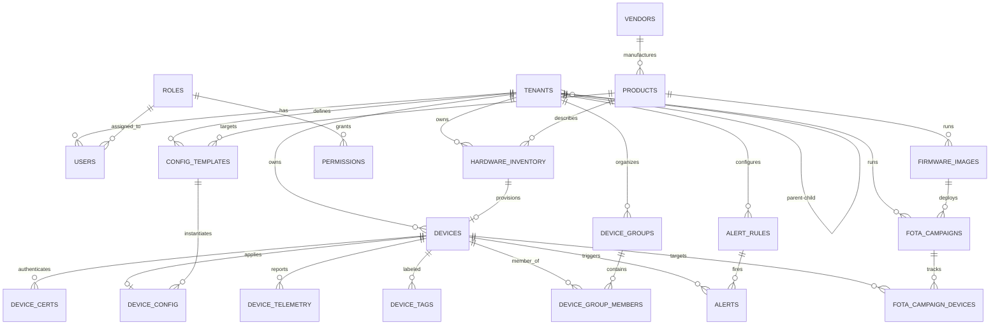

# Comprehensive Database Schema (NCMS)

This document outlines the full relational database schema for a highly scalable, multi-tenant, multi-vendor, and multi-product Device Management Platform (.NET CMS).

The schema is designed to enforce strict data isolation, support massive device fleets, manage configuration templates, and handle PKI-based security.

---

## 1. Core Organizational Tables

### `Tenants` (Clients / Organizations)
Supports multi-tenancy. Every resource in the system belongs to a Tenant.
*   `Id` (GUID, PK)
*   `ParentTenantId` (GUID, FK → Tenants, Nullable) — Allows Reseller → End-Customer hierarchies.
*   `Name` (VARCHAR)
*   `Slug` (VARCHAR, Unique) — URL-friendly identifier (e.g., `niseva`, `acme-corp`).
*   `ContactEmail` (VARCHAR)
*   `MaxDevices` (INT, Nullable) — License limit. NULL = unlimited.
*   `IsActive` (BOOLEAN)
*   `CreatedAt` (DATETIME)
*   `UpdatedAt` (DATETIME)

### `Roles`
Defines platform-wide and tenant-scoped roles for RBAC.
*   `Id` (GUID, PK)
*   `Name` (VARCHAR) — e.g., `SuperAdmin`, `TenantAdmin`, `DeviceManager`, `ReadOnly`, `Installer`
*   `IsSystemRole` (BOOLEAN) — `true` for built-in roles, `false` for custom.

### `Permissions`
Granular permissions assigned to roles.
*   `Id` (GUID, PK)
*   `RoleId` (GUID, FK → Roles)
*   `Resource` (VARCHAR) — e.g., `devices`, `firmware`, `config_templates`, `users`
*   `Action` (VARCHAR) — e.g., `create`, `read`, `update`, `delete`, `provision_reset`

### `Users`
Administrators and users accessing the CMS dashboard.
*   `Id` (GUID, PK)
*   `TenantId` (GUID, FK → Tenants)
*   `RoleId` (GUID, FK → Roles)
*   `Email` (VARCHAR, Unique)
*   `PasswordHash` (VARCHAR)
*   `FullName` (VARCHAR)
*   `IsActive` (BOOLEAN)
*   `LastLoginAt` (DATETIME, Nullable)
*   `CreatedAt` (DATETIME)

---

## 2. Hardware Definition Tables

These tables define the *types* of hardware the system supports, allowing it to be Multi-Vendor and Multi-Product.

### `Vendors` (Manufacturers)
*   `Id` (GUID, PK)
*   `Name` (VARCHAR) — e.g., "Quectel", "Robustel", "MikroTik"
*   `Website` (VARCHAR, Nullable)
*   `CreatedAt` (DATETIME)

### `Products` (Models)
Defines the capabilities and configuration system of a specific hardware model.
*   `Id` (GUID, PK)
*   `VendorId` (GUID, FK → Vendors)
*   `ModelName` (VARCHAR) — e.g., "EC200U", "XR5000"
*   `Architecture` (VARCHAR) — e.g., "mips_24kc", "armv7", "aarch64"
*   `ConfigFormat` (VARCHAR) — **The native config system for this product.** e.g., `uci`, `json_api`, `routeros_cli`, `xml_cwmp`, `yaml_netplan`. Determines which server-side Adapter is used to translate configs.
*   `ConfigSchemaVersion` (VARCHAR, Default "1.0") — Which version of the canonical config schema this product supports.
*   `HasCellular` (BOOLEAN)
*   `HasWifi` (BOOLEAN)
*   `HasEthernet` (BOOLEAN)
*   `HasGps` (BOOLEAN)
*   `HasModbus` (BOOLEAN)
*   `FlashSizeMB` (INT, Nullable)
*   `RamSizeMB` (INT, Nullable)
*   `Description` (TEXT, Nullable)
*   `CreatedAt` (DATETIME)

---

## 3. Inventory and Provisioning (The Allow-List)

Strict hardware control. Devices cannot exist unless they are in the inventory.

### `HardwareInventory`
The pre-loaded allow-list. All devices must be entered here before they can register.
*   `Id` (GUID, PK)
*   `TenantId` (GUID, FK → Tenants) — Strict isolation. Required, not nullable.
*   `ProductId` (GUID, FK → Products) — Links to the Model/Vendor.
*   `SerialNumber` (VARCHAR(64), Unique) - Required bootstrap identifier used for current registration.
*   `IdentityPolicy` (VARCHAR, Default `serial_only`) - Validation mode, e.g., `serial_only`, `serial_plus_imei`, `serial_plus_base_mac`, `serial_plus_vendor_fingerprint`.
*   `IdentityClaims` (JSONB, Nullable) - Optional expected claims for stricter products such as IMEI, base MAC, vendor device ID, or device fingerprint.
*   `Status` (ENUM) — `PENDING_ACTIVATION`, `ACTIVE`, `DECOMMISSIONED`, `EXPIRED`
*   `ActivationWindowStart` (DATETIME, Nullable) — Optional time-bounded activation.
*   `ActivationWindowEnd` (DATETIME, Nullable) — If set, device cannot register after this time.
*   `DeviceId` (GUID, FK → Devices, Nullable) — Linked after first successful registration.
*   `ImportedAt` (DATETIME)
*   `ImportedByUserId` (GUID, FK → Users) — Who added this inventory record.

---

## 4. Operational Device Tables

These tables track the active, provisioned devices.

### `Devices`
Created only after a successful HTTPS registration.
*   `Id` (GUID, PK) — The Canonical Device UUID used for MQTT/PKI.
*   `HardwareInventoryId` (GUID, FK → HardwareInventory, Unique) — 1:1 map to inventory.
*   `TenantId` (GUID, FK → Tenants) — **Denormalized** from `HardwareInventory.TenantId` for query performance. Must be updated via application cascade if the inventory tenant changes.
*   `Name` (VARCHAR, Nullable) — User-friendly display name (e.g., "Branch Office Router #3").
*   `Status` (ENUM) — `ONLINE`, `OFFLINE`, `PROVISIONING`, `FIRMWARE_UPDATING`, `ERROR`
*   `LastSeenAt` (DATETIME, Nullable) — Updated by MQTT heartbeats.
*   `CurrentFirmwareVersion` (VARCHAR, Nullable)
*   `CurrentAgentVersion` (VARCHAR, Nullable)
*   `WanIpAddress` (VARCHAR, Nullable) — WAN IP reported by device.
*   `MacAddresses` (JSONB, Nullable) — All MAC addresses reported by device.
*   `Latitude` (DECIMAL, Nullable) — GPS or manually set.
*   `Longitude` (DECIMAL, Nullable)
*   `Notes` (TEXT, Nullable) — Free-form admin notes.
*   `CreatedAt` (DATETIME) — First registration time.
*   `UpdatedAt` (DATETIME)

### `DeviceCertificates` (PKI Management)
Stores the mTLS credentials for each device. A device may have multiple certificates over its lifetime (historical + current).
*   `Id` (GUID, PK)
*   `DeviceId` (GUID, FK → Devices)
*   `Thumbprint` (VARCHAR) — SHA-256 hash of the certificate.
*   `SubjectName` (VARCHAR) — `CN={Device UUID}`.
*   `IssuedAt` (DATETIME)
*   `ExpiresAt` (DATETIME)
*   `RevokedAt` (DATETIME, Nullable)
*   `RevocationReason` (VARCHAR, Nullable) — e.g., "Admin decommission", "Key compromise", "Renewal"
*   `IsActive` (BOOLEAN) — Only one cert per device can be active at a time.

### `DeviceGroups` (Organizing Devices)
Allows admins to group devices by site, region, project, or custom label.
*   `Id` (GUID, PK)
*   `TenantId` (GUID, FK → Tenants)
*   `Name` (VARCHAR) — e.g., "Mumbai Branch", "Phase 2 Rollout"
*   `Description` (TEXT, Nullable)
*   `CreatedAt` (DATETIME)

### `DeviceGroupMembers` (Many-to-Many)
A device can belong to multiple groups.
*   `Id` (GUID, PK)
*   `DeviceGroupId` (GUID, FK → DeviceGroups)
*   `DeviceId` (GUID, FK → Devices)
*   `AddedAt` (DATETIME)
*   **Unique Constraint:** (`DeviceGroupId`, `DeviceId`)

### `DeviceTags` (Lightweight Labels)
Key-value metadata attached to devices for filtering and search.
*   `Id` (GUID, PK)
*   `DeviceId` (GUID, FK → Devices)
*   `Key` (VARCHAR) — e.g., "region", "site_id", "installer"
*   `Value` (VARCHAR) — e.g., "west", "SITE-042", "John"
*   **Unique Constraint:** (`DeviceId`, `Key`)

---

## 5. Telemetry & Monitoring

### `DeviceTelemetry` (Timeseries Data)
*Ideally stored in a Timeseries DB (TimescaleDB, InfluxDB). If using PostgreSQL, use the TimescaleDB extension and make this a hypertable partitioned by `Time`.*
*   `Time` (TIMESTAMP, PK component) — Partition key.
*   `DeviceId` (GUID, FK → Devices, PK component)
*   `CpuUsagePercent` (FLOAT)
*   `RamUsageMB` (INT)
*   `RamTotalMB` (INT)
*   `StorageUsedMB` (INT, Nullable)
*   `StorageTotalMB` (INT, Nullable)
*   `SignalStrengthRssi` (INT, Nullable) — Cellular signal.
*   `SignalQualityRsrp` (INT, Nullable)
*   `UptimeSeconds` (BIGINT)
*   `WanIpAddress` (VARCHAR, Nullable)
*   `TemperatureCelsius` (FLOAT, Nullable)
*   `Payload` (JSONB, Nullable) — Catch-all for product-specific metrics not covered by fixed columns.

### `AlertRules` (Threshold Definitions)
Defines conditions that trigger alerts.
*   `Id` (GUID, PK)
*   `TenantId` (GUID, FK → Tenants)
*   `Name` (VARCHAR) — e.g., "High CPU Alert"
*   `Metric` (VARCHAR) — e.g., `cpu_usage_percent`, `signal_strength_rssi`, `device_offline`
*   `Operator` (ENUM) — `GT`, `LT`, `EQ`, `OFFLINE_FOR`
*   `ThresholdValue` (FLOAT) — e.g., `90` (for CPU > 90%)
*   `DurationSeconds` (INT, Nullable) — Sustained duration before firing (e.g., 300 = 5 min)
*   `Severity` (ENUM) — `INFO`, `WARNING`, `CRITICAL`
*   `NotifyEmail` (BOOLEAN)
*   `NotifyWebhook` (BOOLEAN)
*   `WebhookUrl` (VARCHAR, Nullable)
*   `IsActive` (BOOLEAN)
*   `CreatedAt` (DATETIME)

### `Alerts` (Fired Alert Instances)
*   `Id` (GUID, PK)
*   `AlertRuleId` (GUID, FK → AlertRules)
*   `DeviceId` (GUID, FK → Devices)
*   `TenantId` (GUID, FK → Tenants)
*   `FiredAt` (DATETIME)
*   `ResolvedAt` (DATETIME, Nullable) — NULL = still active.
*   `CurrentValue` (FLOAT) — The metric value that triggered the alert.
*   `Message` (VARCHAR)
*   `AcknowledgedByUserId` (GUID, FK → Users, Nullable)

---

## 6. Configuration Management

### `ConfigurationTemplates`
Reusable blocks of configuration. Templates are **always stored in Canonical JSON** — a vendor-neutral format. The CMS translates them into the vendor's native format at push time using the Product's `ConfigFormat` field.
*   `Id` (GUID, PK)
*   `TenantId` (GUID, FK → Tenants)
*   `ProductId` (GUID, FK → Products) — A template is tied to a specific hardware model to prevent misapplication.
*   `Name` (VARCHAR) — e.g., "Standard Branch WiFi Config"
*   `Version` (INT) — Incremented on each edit. Allows tracking which version a device is synced to.
*   `Payload` (JSONB) — **Always Canonical JSON.** Never vendor-specific. See [config_abstraction_layer.md](config_abstraction_layer.md) for the schema.
*   `CreatedByUserId` (GUID, FK → Users)
*   `CreatedAt` (DATETIME)
*   `UpdatedAt` (DATETIME)

### `DeviceConfigurations`
The specific configuration intended for a device. Stores both the canonical (CMS-side) and native (device-side) representations.
*   `Id` (GUID, PK)
*   `DeviceId` (GUID, FK → Devices, Unique) — 1:1 relationship.
*   `TemplateId` (GUID, FK → ConfigurationTemplates, Nullable) — If derived from a template.
*   `TemplateVersion` (INT, Nullable) — Which version of the template was applied.
*   `DesiredPayload` (JSONB) — **Canonical JSON.** What the CMS wants the device to have.
*   `DesiredNativePayload` (TEXT, Nullable) — **Vendor-native format.** Cached translation of `DesiredPayload` using the Product's adapter (e.g., UCI commands, XML, etc.). Regenerated whenever `DesiredPayload` changes.
*   `ReportedNativePayload` (TEXT, Nullable) — What the device reports in its native format.
*   `ReportedPayload` (JSONB, Nullable) — **Canonical JSON.** The device's native report translated back for UI display and diff comparison.
*   `SyncStatus` (ENUM) — `IN_SYNC`, `PENDING_PUSH`, `PUSHED_AWAITING_ACK`, `ERROR`
*   `LastPushedAt` (DATETIME, Nullable)
*   `LastAckedAt` (DATETIME, Nullable) — When the device confirmed it applied the config.
*   `ErrorMessage` (TEXT, Nullable)

---

## 7. Firmware Over-The-Air (FOTA)

### `FirmwareImages`
The FOTA Vault. Stores metadata about available firmware binaries.
*   `Id` (GUID, PK)
*   `ProductId` (GUID, FK → Products) — Which hardware model this binary is for.
*   `Version` (VARCHAR) — Semantic versioning (e.g., "1.2.3").
*   `FileName` (VARCHAR)
*   `FileSizeBytes` (BIGINT)
*   `BlobUrl` (VARCHAR) — S3 / Azure Blob link to the `.bin` file.
*   `ChecksumSHA256` (VARCHAR) — For device-side verification before `sysupgrade`.
*   `ReleaseNotes` (TEXT, Nullable)
*   `IsStable` (BOOLEAN) — Distinguishes release from beta.
*   `UploadedByUserId` (GUID, FK → Users)
*   `CreatedAt` (DATETIME)

### `FotaCampaigns`
Defines a bulk firmware update operation.
*   `Id` (GUID, PK)
*   `TenantId` (GUID, FK → Tenants)
*   `FirmwareImageId` (GUID, FK → FirmwareImages)
*   `Name` (VARCHAR) — e.g., "Q2 Security Patch"
*   `Status` (ENUM) — `DRAFT`, `SCHEDULED`, `RUNNING`, `PAUSED`, `COMPLETED`, `CANCELLED`
*   `ScheduledAt` (DATETIME, Nullable) — When the campaign should start.
*   `StartedAt` (DATETIME, Nullable)
*   `CompletedAt` (DATETIME, Nullable)
*   `CreatedByUserId` (GUID, FK → Users)
*   `CreatedAt` (DATETIME)

### `FotaCampaignDevices` (Per-Device Tracking)
Tracks the update status for each individual device in a campaign.
*   `Id` (GUID, PK)
*   `CampaignId` (GUID, FK → FotaCampaigns)
*   `DeviceId` (GUID, FK → Devices)
*   `Status` (ENUM) — `PENDING`, `NOTIFIED`, `DOWNLOADING`, `INSTALLING`, `SUCCESS`, `FAILED`, `SKIPPED`
*   `PreviousFirmwareVersion` (VARCHAR, Nullable) — What the device was running before.
*   `AttemptCount` (INT, Default 0)
*   `ErrorMessage` (TEXT, Nullable)
*   `StartedAt` (DATETIME, Nullable)
*   `CompletedAt` (DATETIME, Nullable)
*   **Unique Constraint:** (`CampaignId`, `DeviceId`)

---

## 8. Audit & Logging

### `AuditLogs`
Immutable audit trail for compliance and forensics.
*   `Id` (GUID, PK)
*   `TenantId` (GUID, FK → Tenants, Nullable) — NULL for system-level events.
*   `UserId` (GUID, FK → Users, Nullable) — NULL for device-initiated events.
*   `DeviceId` (GUID, FK → Devices, Nullable) — NULL for user-initiated events.
*   `Action` (VARCHAR) — e.g., `device.registered`, `device.decommissioned`, `cert.revoked`, `config.pushed`, `fota.started`, `user.login`, `inventory.imported`
*   `ResourceType` (VARCHAR) — e.g., `Device`, `FirmwareImage`, `ConfigTemplate`
*   `ResourceId` (GUID, Nullable) — ID of the affected resource.
*   `Details` (JSONB, Nullable) — Additional context (e.g., old vs new values).
*   `IpAddress` (VARCHAR, Nullable)
*   `CreatedAt` (DATETIME)

---

## Relationship Diagram (Mermaid ERD)

